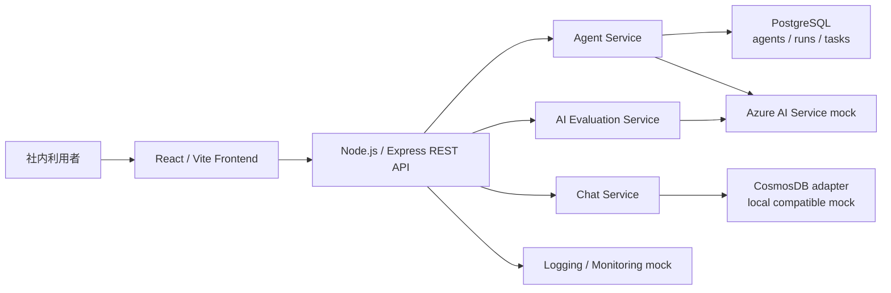
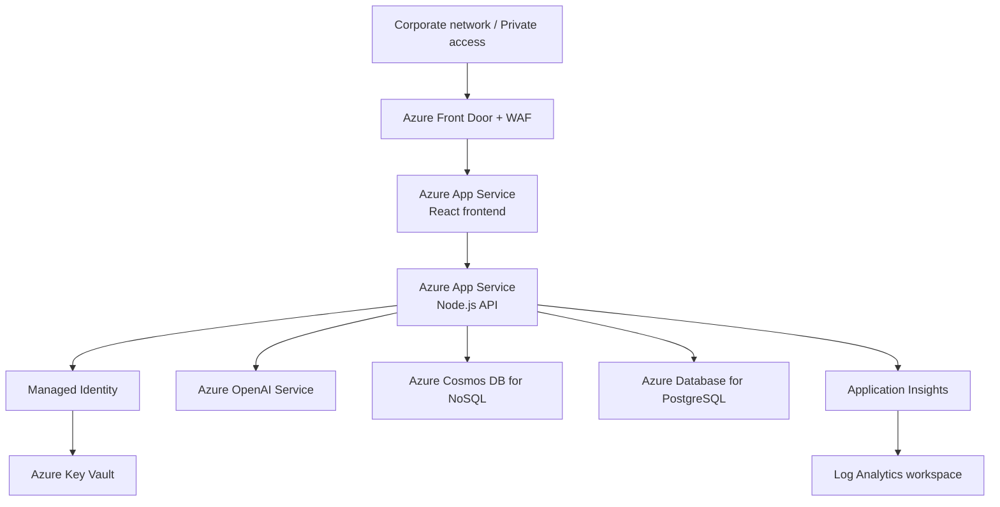
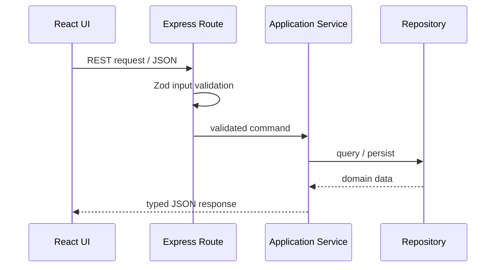
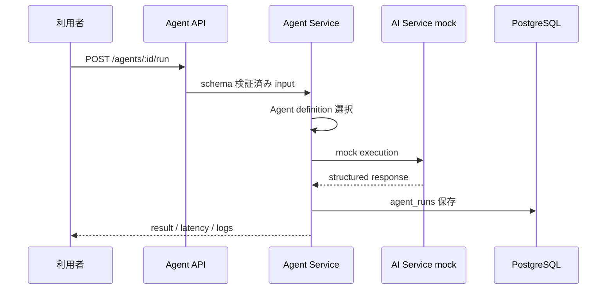

# アーキテクチャ設計

## 1. システム構成

Frontend は表示とユーザー操作、Express は入力検証とユースケース調整、Service は業務処理、Repository は保存先差異を担当します。外部AIやAzure Cosmos DBへの接続を境界に閉じ込め、ローカルでも同じ API 契約を検証できます。

## 2. Azure 想定アーキテクチャ

本番では private endpoint、VNet integration、Managed Identity、Key Vault、WAF を組み合わせる想定です。本リポジトリはクラウド費用と秘密情報を必要とせず確認できるよう、外部サービスを mock 化しています。

## 3. データフロー

1. React がユーザー入力を受け、API client が JSON へ変換します。
2. Express route が Zod schema で入力を検証します。
3. Controller が対応 Service を呼び、Service が Agent definition または Repository を調整します。
4. 構造化データは PostgreSQL、会話系 document は CosmosDB adapter へ保存します。
5. レスポンスは機密情報を除いた JSON として UI へ返ります。

## 4. API の流れ

## 5. Agent 実行フロー

各 Agent は入力 schema、実行ロジック、mock 応答を持ちます。入力違反は 400、未登録 Agent は 404、予期しない例外は詳細を隠した 500 とします。

## 6. 認証フロー

認証方式は案件中未明記のため、この sample では簡易 mock login として実装しています。画面上の mock login は `sessionStorage` だけを使い、本人確認や認可を提供しません。

本番想定では、React → Microsoft Entra ID → OIDC token → Express middleware → RBAC 判定という流れへ置換します。mock login は UI 導線確認だけのため、業務利用できません。
